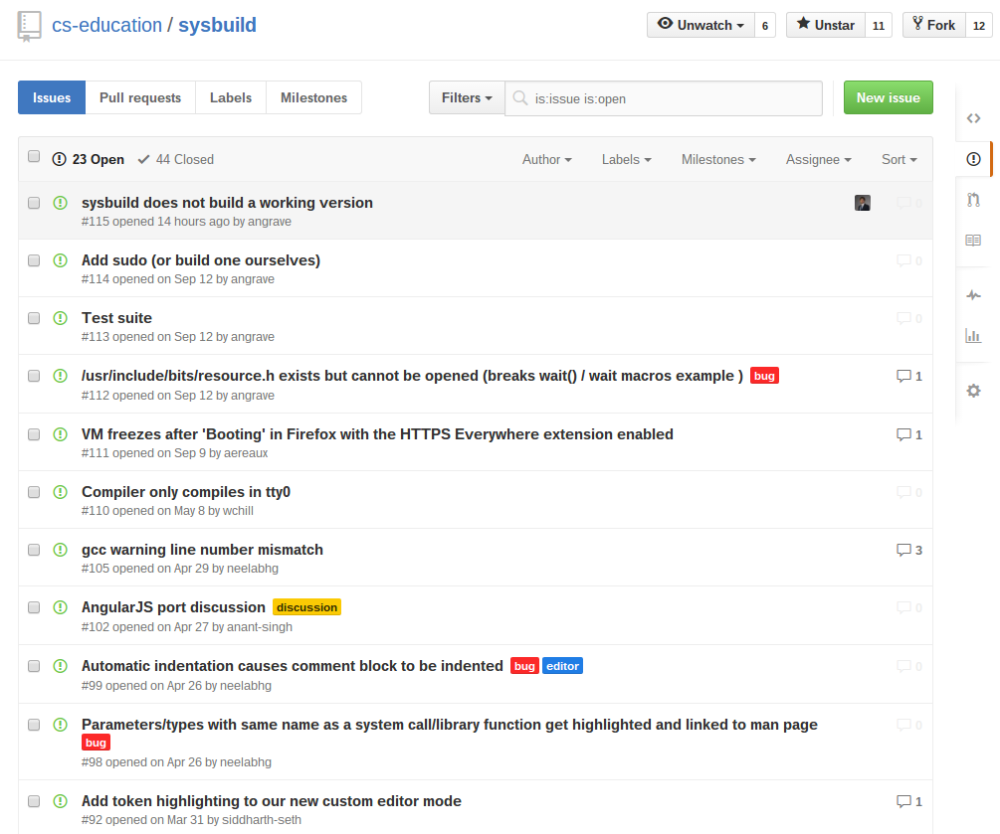
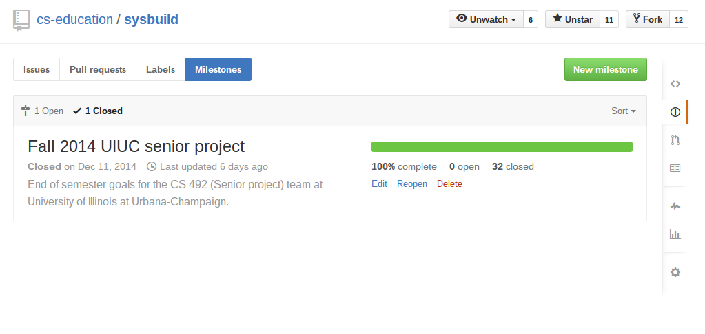
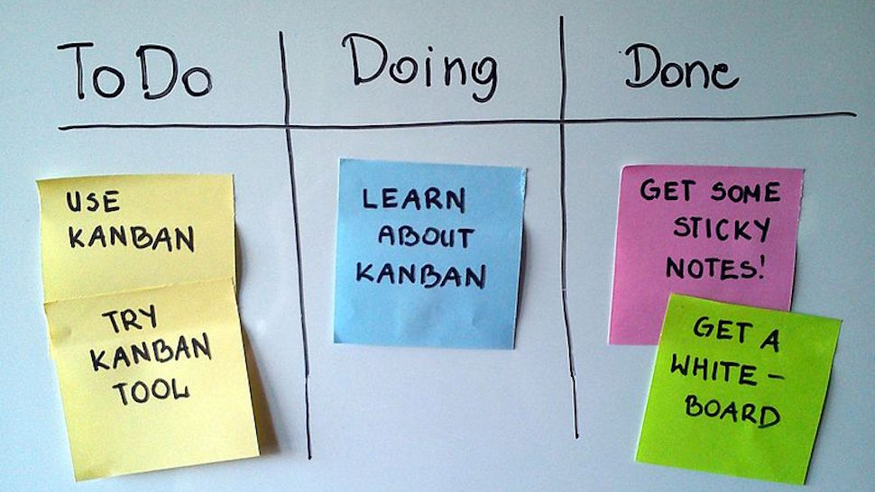
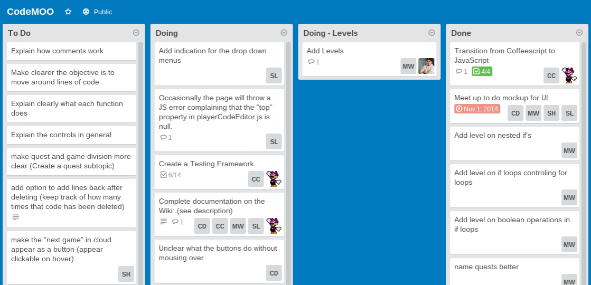
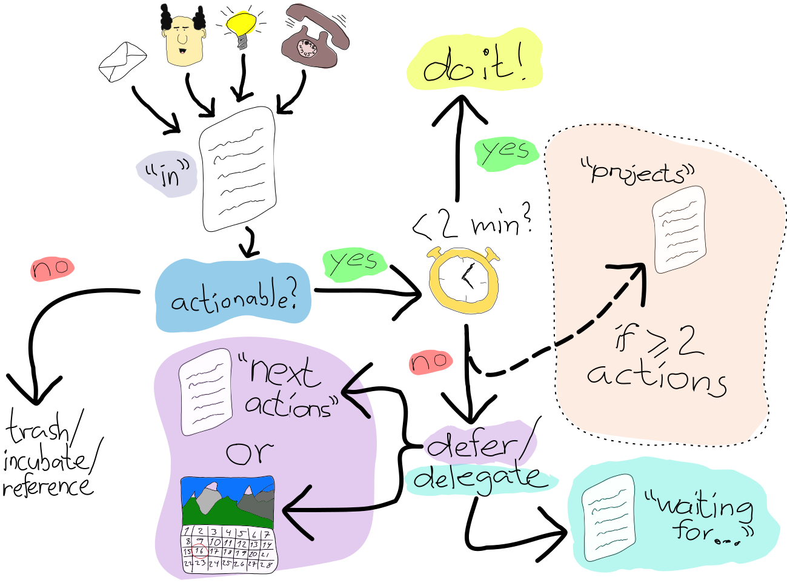
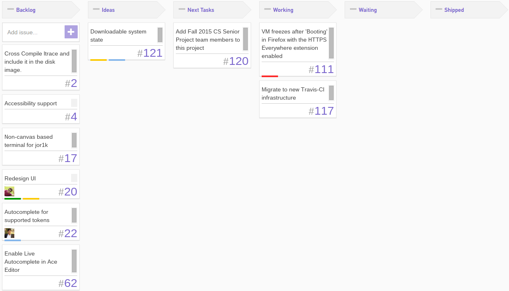
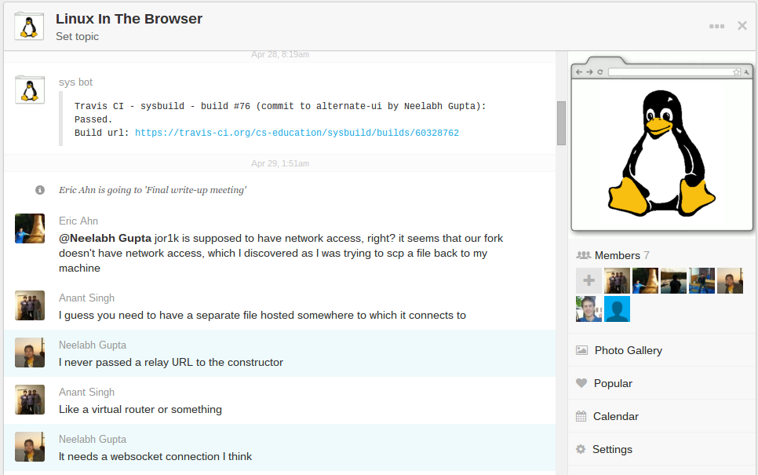
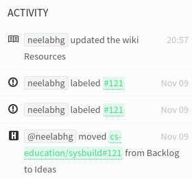
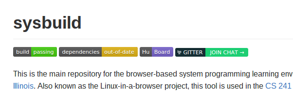

layout: true

  

  
  

---

class: middle

# Methods and tools for productively managing your project

### CS Senior Projects Fall 2015

### Neelabh Gupta
October 20, 2015  
<small>(slides created November 10, 2015)</small>

---

# Me

* Took Senior Projects in 2014 (CS 492 Fall 2014 and CS 494 Spring 2015)

* Worked on Linux-in-a-browser project

# Team

  - 7 members, largest 2014 team on a single project

  - Shipped multiple features

  - Successful collaboration

???

I'm here to share my experience working on and organizing the project, and talk
about new tools and methodologies I recently found which seem very helpful.

---

# Issues with Issues

.center[]

---

# Issues with Issues

* Hard to visualize

--

* Hard to prioritize

--

* Can't see who is doing what

--

* Hard to see progress

--

* Can't see current status of project

---

# What about Milestones?

.center[]

--

* Our team didn't use milestones properly

--

* Semester milestones were too broad (but useful for TAs and write-ups)

--

* Feature specific milestones would probably have been too narrow

--

* Hard to visualize:

---

# A better system

--

* Lets you visualize your project &mdash; a quick glance should ideally show the current status

--

* Keeps everyone on the same page &mdash; every team member knows what they should be doing and what everyone else is doing

--

* Has low overhead in creating tasks, assigning to people, updating progress

--

* Clearly shows what needs to be done, what is being done, and what has been accomplished

--

* Keeps "blocked" tasks separate

---

# Productivity System &mdash; [Personal Kanban](http://www.personalkanban.com/pk/personal-kanban-101/)
"A simple way to visualize and control your work"

--

.center[]

--

Two main "rules":
* Visualize Your work
* Limit Your Work In Progress (WIP)

.right[<small>Image and "rules" source: [Lifehacker](http://lifehacker.com/productivity-101-how-to-use-personal-kanban-to-visuali-1687948640)</small>]

???

Personal Kanban applies to teams as well

---

# Personal Kanban Example
[CodeMOO (JavaPlayland) 2014](https://seniorprojects.cs.illinois.edu/confluence/display/CM2014/Code+MOO+2014+Home)
used Trello instead of GitHub:

.center[]

---

# Productivity System &mdash; [Getting Things Done](http://gettingthingsdone.com/)

.center[]

.right[<small>Image source: [Hamberg's GTD guide](https://hamberg.no/gtd/). Also see [Lifehacker's GTD primer](http://lifehacker.com/productivity-101-a-primer-to-the-getting-things-done-1551880955)</small>]

???

From [Lifehacker](http://lifehacker.com/productivity-101-a-primer-to-the-getting-things-done-1551880955):
* Detailed and thorough method for organizing to-dos, priorities, and schedule to make them manageable

* Easy to see what you have on your plate and choose what to work on next

* Strong emphasis on getting your to-dos out of your head and into a system you can refer to.
  This clears your mind of any mental distractions that will keep you from working efficiently.

---

# Best of both &mdash; Personal Kanban + GTD

--

[HuBoard](https://huboard.com/cs-education/sysbuild) newly implemented in Linux-in-a-browser project:

.center[]

--

.right[<small>Also see [The Agile Coach: A brief introduction to kanban &mdash; Atlassian](https://www.atlassian.com/agile/kanban/)</small>]

---

# Extra advantages

--

* The task board can be shared with the client, liaison and course staff

--

* Course staff can see the status of a project at a glance

--

  - Shorter (and more productive) weekly progress meetings with course staff

--

* Team members are more accountable

--

* Some people choose to delete completed tasks, but it is recommended to keep a "done" or "shipped" list

--

  - Team accomplishments are clear and visible

--

  - [Seeing your accomplishments will provide a motivation boost](http://lifehacker.com/5960794/keep-your-completed-to-do-lists-on-a-done-wall-to-stay-motivated)

---

# Tools with Kanban-style boards

* [GitHub collaboration integrations](https://github.com/integrations/feature/collaborate):

  - [HuBoard](https://huboard.com/) (free for public projects)

  - [ZenHub](https://www.zenhub.io/) (free for students and open source projects)

  - [Waffle](https://waffle.io/) (free)

* [Trello](https://trello.com/) (free)

* [Agile boards in Senior Projects JIRA](https://seniorprojects.cs.illinois.edu/jira/secure/RapidStart.jspa)

* Many more:

  - [Curated list of bug and issue trackers](https://github.com/cjbarber/ToolsOfTheTrade#bugissue-tracking)

  - [Curated list of planning and project management tools](https://github.com/cjbarber/ToolsOfTheTrade#planning--project-management)

???

Senior Projects JIRA is obviously free for Senior Projects students.

---

# Communication

--

* Everyone should be involved and on the same page

--

* Replies should be quick(er)

--

* Barrier to communication should be low &mdash; no one should hesitate to ask questions within the team

--

* Email is formal, slow and cluttered (although works fine for communicating with client)

--

* Use group chat

---

# Example

Our team used [GroupMe](https://groupme.com/).
A [bot](https://github.com/neelabhg/groupme-bot) even notified about
[Travis CI](https://travis-ci.org/cs-education/sysbuild) build statuses:

.center[]

---

# Example

[Gitter](https://gitter.im/) chat rooms newly setup for Linux-in-a-browser project.

--

* One public chat room for community engagement &mdash; integrated with GitHub, Travis CI and HuBoard

--

* Links prominently placed in README:

--

* Private chat rooms for each year's Senior Project team

---

# Group communication tools

* [GitHub collaboration integrations](https://github.com/integrations/feature/collaborate):

  - [Slack](https://slack.com/) (free)

  - [Gitter](https://gitter.im/) (free)

* [HipChat](https://www.hipchat.com/) (free)

* Many more:

  - [Curated list of group communication and chat tools](https://github.com/cjbarber/ToolsOfTheTrade#group-communicationchat-tools)

---
class: center, middle

### Neelabh Gupta

[@neelabhg](https://twitter.com/neelabhg)  
[neelabhgupta.com](http://neelabhgupta.com/)
