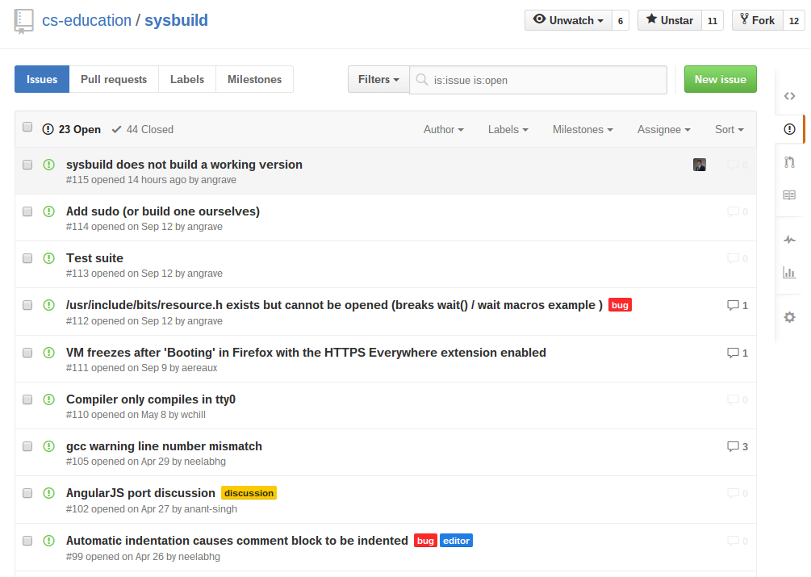
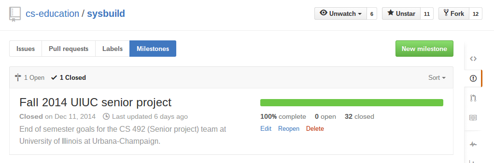

class: center, middle

## Methods and tools for productively managing your project

## CS Senior Projects Fall 2015

### Neelabh Gupta
October 20, 2015  
<small>(slides created November 5, 2015)</small>

???

Notes for the _first_ slide!

---

# Issues with Issues

.center[]

---

# Issues with Issues

* Hard to visualize

--

* Hard to prioritize

--

* Can't see who is doing what

--

* Hard to see progress

--

* Can't see current status of project

---

# What about Milestones?

--

* Our team didn't use milestones properly

--

* Semester milestones were too broad

--

* Feature specific milestones would have been too narrow

--

* Hard to visualize:

---

# A better system
* Lets you visualize your work
* Keeps everyone on the same page

---

# Personal Kanban

[Lifehacker](http://lifehacker.com/productivity-101-how-to-use-personal-kanban-to-visuali-1687948640)

