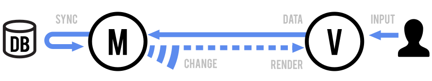
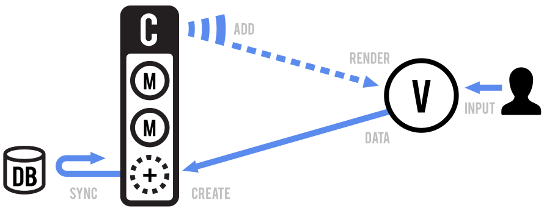

title: Intro to Backbone.js
author:
  name: Neelabh Gupta
  twitter: neelabhg
  url: http://neelabhgupta.com
output: index.html
controls: false
theme: ../cleaver-theme

-- title-slide

# Intro to Backbone.js
## Why and how to use one of the most popular front-end JavaScript libraries
### ACM @ UIUC - WebMonkeys

#### Neelabh Gupta
##### October 26, 2015

--

### Who am I?

* Computer Engineering, Class of 2015
* [Several projects](https://github.com/neelabhg) using a variety of languages, tools, frameworks

--

### What is Backbone.js?
* Open source JavaScript library for front-end web apps
* Provides a backbone (structure) to JavaScript apps
* Rich API to handle
    - CRUD
    - RESTful JSON APIs
    - Event handling
    - Views

--

### [Last talk](https://neelabhg.github.io/presentations/webmonkeys/front-end): Writing client-side applications
* Document: HTML
* Styling: CSS (Sass, LESS)
* Scripting: JavaScript (CoffeeScript, TypeScript)
* Tools (building, testing, deploying)
* Libraries (MVC frameworks, DOM libraries)

--

### [Last talk](https://neelabhg.github.io/presentations/webmonkeys/front-end): Why use a framework?

* Help manage complexity and write organized, maintainable, reusable code
* Take care of common concerns (DOM, templates, routing, etc)
* Provide best-practices in the form of conventions
* MVC (or MVVM or MV*) helps prevent [this](https://github.com/neelabhg/spelling-bee-phonegap/blob/master/www/js/app.js)

--

### Why use Backbone.js?
* Library, not a framework
    - No Inversion of control (You call it)
    - Flexibility
    - [Last talk: Libraries vs Frameworks case study](https://neelabhg.github.io/presentations/webmonkeys/front-end)
* Very popular and well liked
* Interoperable with other libraries
* Small - Easy to learn and understand ([annotated source!](http://backbonejs.org/docs/backbone.html))

--

### Problems with Backbone.js
* Library, not a framework
    - No out-of-the-box architecture
    - Less opinionated
    - Design designs up to user
    - More time to bootstrap project
* Lacking view management

--

### Who uses Backbone.js?
* [Trello](http://backbonejs.org/#examples-trello)
* [Bitbucket](http://backbonejs.org/#examples-bitbucket)
* [Code School](http://backbonejs.org/#examples-code-school)
* [Airbnb](http://backbonejs.org/#examples-airbnb)
* [Many more...](http://backbonejs.org/#examples)

--

### Backbone.js basics
* [Backbone, The Primer](https://github.com/jashkenas/backbone/wiki/Backbone,-The-Primer)
* Models
* Views
* Collections
* Events
* Not covered: Router and [Underscore.js](http://underscorejs.org/)

--

### Backbone.js basics: Models and Views

###### From http://backbonejs.org/

--

### Backbone.js basics: Collections

###### From http://backbonejs.org/

--

### Backbone.js basics: View Rendering

###### From http://backbonejs.org/

--

### Getting started: Hands-on
* [Node.js + NPM](https://nodejs.org/)
* [Yeoman](http://yeoman.io/)
* [Backbone generator](https://github.com/yeoman/generator-backbone)

--

### Resources
* [Homepage](http://backbonejs.org/)
* [Backbone.js Wiki](https://github.com/jashkenas/backbone/wiki)
* [More](https://github.com/instanceofpro/awesome-backbone)
