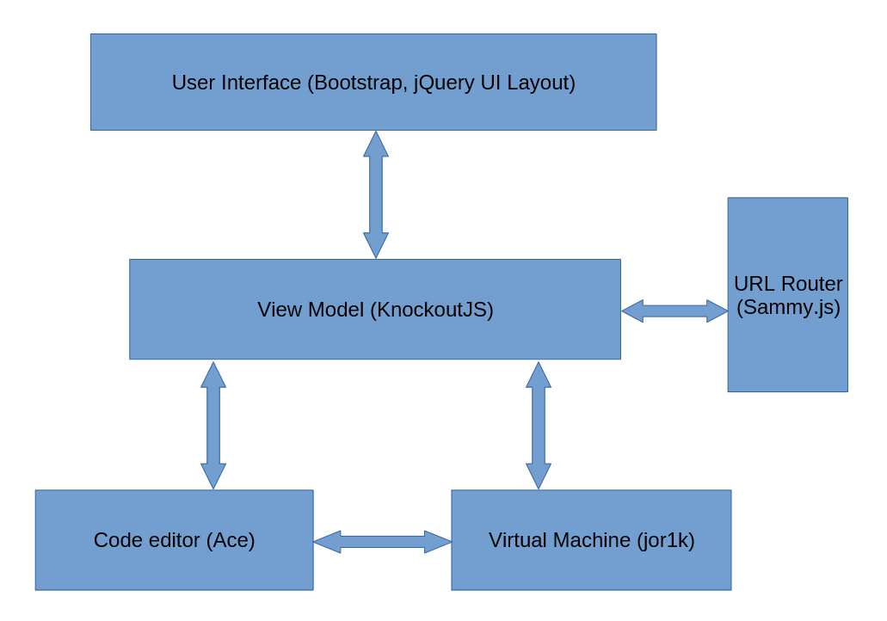

title: Modern Front-end Development
author:
  name: Neelabh Gupta
  twitter: neelabhg
  url: http://neelabhgupta.com
output: index.html
controls: false
theme: ../cleaver-theme

-- title-slide

# Starting Front-end Development
## Tools and frameworks for creating modern web applications
### ACM @ UIUC - WebMonkeys

#### Neelabh Gupta
##### October 19, 2015
##### (slides revised November 4, 2015)


--

### Who am I?

* Computer Engineering, Class of 2015
* Technical lead on the [System Programming Learning Environment](http://cs-education.github.io/sys/)
  project used in CS 241
* [Several projects](https://github.com/neelabhg) using a variety of languages, tools, frameworks

--

### Why am I here?

[Yet Another Framework Syndrome (YAFS)](https://medium.com/tastejs-blog/yet-another-framework-syndrome-yafs-cf5f694ee070):
> "Almost every day, we see new libraries, frameworks and tools being released in the JavaScript community - many of
   which simply reinvent the wheel."

--

### Why am I here?

> "If you're an experienced developer speaking to someone stuck on a decision, try to help them simplify their options.
  It's a freeing experience and may help narrow down their choices to something that doesn't feel so daunting.
  Even taking a few off the potential list can give them an opportunity to get more clarity and choose something
  they can at least evaluate before making a final decision."  
  -- [Addy Osmani, *Front-end Choice Paralysis*](https://the-pastry-box-project.net/addy-osmani/2014-January-19)

--

### Writing client-side applications
* Document: HTML
* Styling: CSS (Sass, LESS)
* Scripting: JavaScript (CoffeeScript, TypeScript)
* Tools (building, testing, deploying)
* Libraries (MVC frameworks, DOM libraries)

--

### Why use MV* frameworks?
* Help manage complexity and write organized, maintainable, reusable code
* Take care of common concerns (DOM, templates, routing, etc)
* Provide best-practices in the form of conventions

--

### Why use MV* frameworks?
MVC (or MVVM or MV*) helps prevent [this](https://github.com/neelabhg/spelling-bee-phonegap/blob/master/www/js/app.js):
```javascript
$("#checkAnswerButton").off("click").on("click", function () {
    numTries += 1;
    if ($("#wordInput").val().toLowerCase() === word.word.toLowerCase()) {//correct answer
        results['correctCount'] += 1;
        results.words.push({ word: word.word, result: 'correct' });
        $("#dialogHeading").text("Correct answer!");
        $("#correctWord").text(word.word);
        $("#wordDonePopup").popup("open");
    } else {//incorrect answer
        $("#incorrectAnswerMsg").show();
        if (numTries === settings.maxTries) {//max number of tries reached
            results['incorrectCount'] += 1;
            results.words.push({ word: word.word, result: 'incorrect' });
            $("#dialogHeading").text("Incorrect answer");
            $("#correctWord").text(word.word);
            $("#wordDonePopup").popup("open");
        } else {
            $("#numTriesDisplay").text(numTries);
        }
    }
});
```

--

### TodoMVC

* [todomvc.com](http://todomvc.com/) and [github.com/tastejs/todomvc](https://github.com/tastejs/todomvc)
* The same Todo application implemented in most of the popular JavaScript MV* frameworks
* Can be used to study the syntax for defining models, views, controllers
  and classes in different frameworks to see how it feels using it first-hand
* Helps find what well-developed frameworks match your mental model of application architecture
* Not meant to showcase all features of a given framework

--

### Case study: System Programming Learning Environment

* A browser-based system programming learning tool used in CS 241
* Open source; Uses [GitHub](https://github.com/cs-education/sysbuild) for collaboration
* Purely client-side; hosted on [GitHub Pages](https://pages.github.com/)
* Written in JavaScript (ES5, porting to ES6 soon)
* Uses HTML, CSS and [Sass](http://sass-lang.com/)
* [Live demo](http://cs-education.github.io/sys/)

<small>(Note: The project is under active development. This talk refers to the project upto
[this commit](https://github.com/cs-education/sysbuild/tree/2eb401a7c28414c2799426f689b4dbe5ef4fe784)).</small>

--

### Case study: System Programming Learning Environment
#### Architecture



--

### Case study: System Programming Learning Environment
#### Libraries

* [KnockoutJS](http://knockoutjs.com/) - Model-View-View-Model framework with two-way data binding
* [Bootstrap](http://getbootstrap.com/) - User interface and design components
* [Sammy.js](http://sammyjs.org/) - URL routing
* [jQuery](http://jquery.com/) - DOM manipulation and utility functions

--

### Case study: System Programming Learning Environment
#### Tools

* [Yeoman](http://yeoman.io/) - Initial project scaffolding
* [Bower](http://bower.io/) - Dependency management
* [Travis CI](https://travis-ci.org/) - Continuous Integration
* [Grunt](http://gruntjs.com/) - Task runner (building, testing, deploying)

--

### Case study: System Programming Learning Environment
#### Tools: [Some Grunt tasks used](https://github.com/cs-education/sysbuild/blob/030ffef85c67285f2ab5e66855aa5f4fb1b88312/Gruntfile.js)
```javascript
grunt.registerTask('build', [
    'clean:dist', 'useminPrepare', 'concurrent:dist', 'autoprefixer', 'concat', 'cssmin',
    'uglify', 'copy:dist', 'modernizr', 'rev', 'usemin', 'htmlmin', 'writeBuildStamps'
]);
// ...
grunt.registerTask('deploy', 'Deploy the sys project', function (target) {
    var targets = ['staging', 'prod', 'angraveprod'];
    if (targets.indexOf(target) === -1) {
        grunt.log.error('Please specify a valid target. Valid targets are: ' +
            targets.join(', ') + '.');
        return false;
    }
    grunt.config('buildcontrol', {
        options: buildcontrolConfig.options,
        pages: buildcontrolConfig[target]
    });
    grunt.task.run('buildcontrol:pages');
});
```

--

### Case study: System Programming Learning Environment
#### Design decisions: Libraries vs Frameworks

* Favor small libraries over complete "all-in-one" frameworks like AngularJS
* Frameworks have a high learning curve and impose a certain way of writing code
* Difficult to implement features not available in or compatible with the framework
* Counter argument: [Discussion about an AngularJS port](https://github.com/cs-education/sysbuild/issues/102)

--

### Resources
* [A Baseline for Front-End [JS] Developers: 2015](http://rmurphey.com/blog/2015/03/23/a-baseline-for-front-end-developers-2015/)
* [Front-end Tooling Workflows by Addy Osmani (2014)](https://speakerdeck.com/addyosmani/front-end-tooling-workflows)
* [Essential Tools For A Modern Front-end Development Workflow (2013)](http://code.tutsplus.com/tutorials/essential-tools-for-a-modern-front-end-development-workflow--pre-66083)
* [Must-watch videos about javascript](https://github.com/bolshchikov/js-must-watch)
* [A collection of awesome browser-side JavaScript libraries, resources and shiny things](https://github.com/sorrycc/awesome-javascript)
